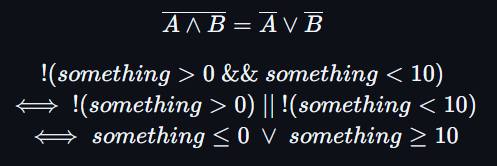

## Exemplos de Código
```c
    int i = 0;
    do{
        print_int10(i);
        i++;
    }while(i<=32)
```
Em Assembly(MIPS)
```asm
    li $t0,0
do:
    li $v0,1 # print_int10()
    move $a0,$t0
    syscall
    addiu $t0,$t0,1 # i++
    ble $t0,32,do
continuation:
```
**Errado**
```asm
    li $t0,0
do:
    li $v0,1
    move $a0,$t0
    syscall
    addiu $t0,$t0,1 # i++
while:
    # Opção 1
    bgt $t0,32,end_while
    j do
    # Opção 2
    ble $t0,32,j do
end_while: # continuation
```

---
```c
    int val;
    unsigned int val1;

    val = val>>2;
    val1 = val1>>3;
```
Assembly(MIPS)
```asm
    # $t0 -> val
    # $t1 -> val1

    # O Valor tem sinal
    # SRA ira preservar o seu sinal
    sra $t0,$t0,2

    # O valor não tem sinal
    # O SRL apenas colocará 0's no MSB
    srl $t1,$t1,3
```
---
```c
    if(something>0 && something<10){
        print_int10(something);
    }else{
        print_int10(0);
    }
```
Lei de Morgan

```c
    if(something<=0 || something>=10){
        print_int10(0);
    }else{
        print_int10(something);
    }

```
```asm
# $t0 -> something
if:
    ble $t0,0,then
    bge $t0,10,then
    j else
then:
    li $v0,1 # print_int10()
    li $a0,0
    syscall
    j continuation
else:
    li $v0,1 # print_int10()
    move $a0,$t0
    syscall

continuation:
```